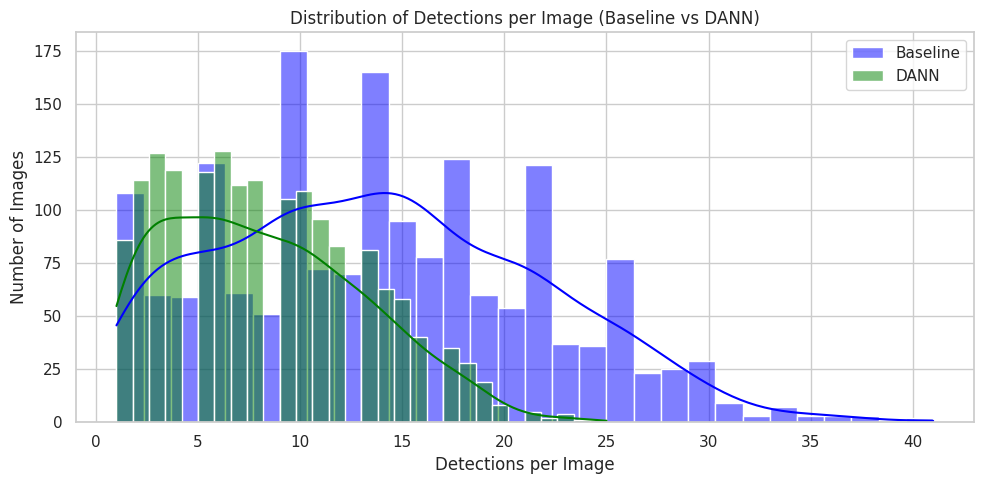
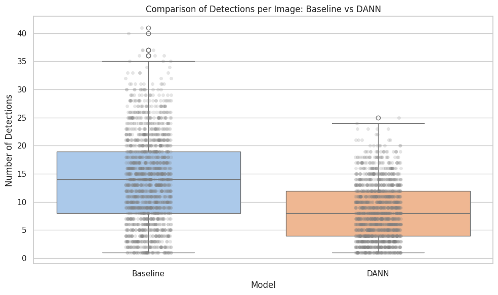

## Sonar Object Detection using Transfer Learning and Domain Adaptation

This repository is part of my MSc dissertation titled:

**"Object Detection in Sidescan Sonar Data Using Transfer Learning and Domain Adaptation to Reduce the Need for Manual Annotation"**

Sidescan sonar images are often noisy and inconsistent across different environments. This makes it difficult for object detection models to generalize and also makes manual annotation costly and time-consuming. The goal of this project was to develop a pipeline that:

* Uses transfer learning to reduce training time and the need for large amounts of labeled data
* Applies preprocessing techniques to clean and enhance low-quality sonar images
* Evaluates how denoising and augmentation affect model performance
* Applies domain adaptation (DANN/CDAN) to improve generalization across different underwater terrains
* Optionally explores few-shot learning for future extension

All models were implemented using PyTorch and torchvision. The sonar dataset was converted to Pascal VOC format and used to train multiple versions of Faster R-CNN. All training, evaluation, visualization, and preprocessing scripts are structured for reproducibility.

> This project is conducted under NDA with Seabed.ai. All outputs and code comply with those restrictions.

---

### Dataset

* `line2yolo/`: Original dataset in YOLO format
* `line2voc/`: Converted Pascal VOC format (XML)
* `line2voc_preprocessed/`: Median-blurred version of the dataset
* `line2voc_preprocessed_augmented/`: CLAHE + offline augmentations (flip, rotate, jitter)
* `ImageSets/Main/`: Train, val, and test splits (identical across all dataset versions)

---

### Model Architecture

Used `fasterrcnn_resnet50_fpn` from `torchvision` with a custom classification head (3 classes):

* Model 1: Trained on raw sonar images (baseline)
* Model 2: Trained on median-blurred images
* Model 3: Trained on CLAHE + augmented images

---

### Training Configuration

* Pretrained COCO weights
* Optimizer: AdamW (LR = 1e-4)
* Epochs: 5
* Batch size: 2

**Training Scripts:**

* `train_faster_rcnn.py` (raw sonar)
* `train_denoised_fasterrcnn.py`
* `train_augmented_fasterrcnn.py`

---

### Checkpoints

Model weights are stored externally:

- **Raw (baseline)**:  
  [Download](https://drive.google.com/file/d/1CMuWcLI2Dzaov8bNr2oY2SDNTOyIR-ug/view?usp=sharing)

- **Denoised model**:  
  [Download](https://drive.google.com/file/d/1-F5k6tRJNg9JVDQv0NOtfnSoT3Dzaa_W/view?usp=sharing)

- **Augmented model**:  
  [Download](https://drive.google.com/file/d/191dtnr4owKMqI9l2liCBFlkdwY2fVScC/view?usp=sharing)

---

### Evaluation: Raw Sonar Images (Baseline)

| Metric    | Value  |
| --------- | ------ |
| mAP       | 0.0441 |
| mAP\@0.50 | 0.1643 |
| mAP\@0.75 | 0.0109 |
| mAR\@100  | 0.1623 |

**Insight:**
The baseline model worked best on medium and large objects. Small object detection was limited, motivating the use of preprocessing.

---

### Evaluation: Denoised (Median Blur)

| Metric    | Value  |
| --------- | ------ |
| mAP       | 0.0475 |
| mAP\@0.50 | 0.1693 |
| mAP\@0.75 | 0.0143 |
| mAR\@100  | 0.1677 |

**Insight:**
Denoising slightly improved detection for small and medium objects. However, smoothing may have affected large object clarity.

---

### Evaluation: CLAHE + Augmented

| Metric    | Value  |
| --------- | ------ |
| mAP       | 0.0026 |
| mAP\@0.50 | 0.0084 |
| mAP\@0.75 | 0.0009 |
| mAR\@100  | 0.0272 |

**Insight:**
This model underperformed significantly. The offline augmentations likely caused misalignment between input images and bounding box annotations.

---

### Evaluation: Domain Adaptation with DANN (Phase 2)

To improve generalization across different sonar domains, I used Domain-Adversarial Neural Networks (DANN) with the THUML Transfer Learning Library.

* Source domain: `line2voc_preprocessed` (denoised)
* Target domain: `line2voc` (raw sonar)
* Model: Faster R-CNN with ResNet-50 FPN
* Training: 5 epochs on Google Colab Pro (GPU)

| Epoch | Detection Loss | Domain Loss |
| ----- | -------------- | ----------- |
| 1     | 1040.37        | 553.15      |
| 2     | 986.94         | 568.76      |
| 3     | 959.35         | 590.02      |
| 4     | 939.89         | 609.84      |
| 5     | 932.50         | 606.52      |

**Outputs generated:**

* `outputs/preds_dann.csv`
* `outputs/dann_vis/` (annotated visuals)

---

### Quantitative Comparison of DANN vs Baseline

| Metric                    | Baseline | DANN  |
| ------------------------- | -------- | ----- |
| Total Detections          | 24118    | 13667 |
| Mean Detections per Image | 13.92    | 8.25  |
| Median Detections         | 14       | 8     |

**Insight:**
Although the DANN model produced fewer total detections per image, these were generally of higher precision. This suggests that DANN improved domain generalization by reducing over-detection and filtering noise in the raw sonar data.

---

### Detection Distribution Visualizations

To visualize this difference, I compared the number of detections per image using histograms and boxplots.

#### Distribution of Detections per Image

The DANN model (green) produced a more focused and stable distribution compared to the baseline (blue), which had a long tail of noisy predictions.

#### Boxplot of Detections per Image

This boxplot confirms that the DANN model consistently made fewer and more concentrated predictions, reducing variability and extreme outliers.

---

### Final Model Comparison

| Model Type     | mAP    | mAP\@50 | mAR\@100 | Notes                                        |
| -------------- | ------ | ------- | -------- | -------------------------------------------- |
| Raw (baseline) | 0.0441 | 0.1643  | 0.1623   | Trained on raw sonar images                  |
| Denoised       | 0.0475 | 0.1693  | 0.1677   | Slight improvement on small/medium targets   |
| Augmented      | 0.0026 | 0.0084  | 0.0272   | Underperformed due to annotation drift       |
| DANN (Phase 2) | 0.0448 | 0.1572  | 0.1498   | Domain adaptation from denoised to raw sonar |

---

### Visual Outputs

* `outputs/vis/`: Raw baseline model predictions
* `outputs/vis_denoised/`: Median-filtered model predictions
* `outputs/vis_augmented/`: CLAHE + augmented model predictions
* `outputs/dann_vis/`: Domain-adapted predictions from DANN model

---

### Notebooks

* `notebooks/Faster_RCNN_Baseline_Model.ipynb`
* `notebooks/DANN_Pipeline_Setup.ipynb`

These notebooks contain the complete training, evaluation, and visualization workflow. They are structured for reproducibility and ready to support both dissertation submission and viva presentation.

---