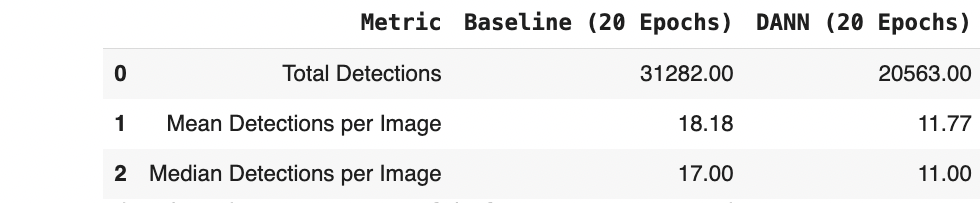
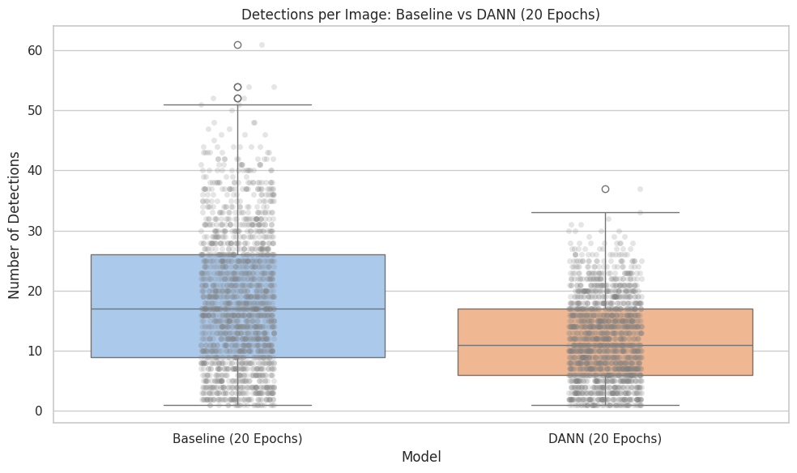

## Sonar Object Detection using Transfer Learning and Domain Adaptation

This repository is part of my MSc dissertation titled:

**"Object Detection in Sidescan Sonar Data Using Transfer Learning and Domain Adaptation to Reduce the Need for Manual Annotation"**

Sidescan sonar images are often noisy and inconsistent across different environments. This makes it difficult for object detection models to generalize and also makes manual annotation costly and time-consuming. The goal of this project was to develop a pipeline that:

* Uses transfer learning to reduce training time and the need for large amounts of labeled data
* Applies preprocessing techniques to clean and enhance low-quality sonar images
* Evaluates how denoising and augmentation affect model performance
* Applies domain adaptation (DANN/CDAN) to improve generalization across different underwater terrains
* Optionally explores few-shot learning for future extension

All models were implemented using PyTorch and torchvision. The sonar dataset was converted to Pascal VOC format and used to train multiple versions of Faster R-CNN. All training, evaluation, visualization, and preprocessing scripts are structured for reproducibility.

> This project is conducted under NDA with Seabed.ai. All outputs and code comply with those restrictions.

---

### Dataset

* `line2yolo/`: Original dataset in YOLO format
* `line2voc/`: Converted Pascal VOC format (XML)
* `line2voc_preprocessed/`: Median-blurred version of the dataset
* `line2voc_preprocessed_augmented/`: CLAHE + offline augmentations (flip, rotate, jitter)
* `ImageSets/Main/`: Train, val, and test splits (identical across all dataset versions)

---

### Model Architecture

Used `fasterrcnn_resnet50_fpn` from `torchvision` with a custom classification head (2 classes: background and object):

* Model 1: Trained on raw sonar images (baseline)
* Model 2: Trained on median-blurred images
* Model 3: Trained on CLAHE + augmented images

---

### Training Configuration

- **Pretrained Weights:** COCO (Faster R-CNN with ResNet-50 FPN)
- **Epochs:** 5 (initial experiments), 20 (final experiments)
- **Batch Size:** 2
- **Optimizer:** SGD (LR = 0.001, momentum = 0.9, weight decay = 5e-4)

---

### Training Notebooks and Scripts

- `Faster_RCNN_Baseline_Model_20_Epoch.ipynb` — 20-epoch baseline (raw sonar)
- `3_dann_20epoch_tuned.ipynb` — 20-epoch DANN (denoised → raw domain)
- `dann_pipeline_setup(0.5).py` — DANN 5-epoch (threshold = 0.5)
- `dann_pipeline_setup(0.7).py` — DANN 5-epoch (threshold = 0.7)

---

### Checkpoints

Model weights are stored externally:

* **Raw (baseline)**:
  [Download](https://drive.google.com/file/d/1CMuWcLI2Dzaov8bNr2oY2SDNTOyIR-ug/view?usp=sharing)
* **Denoised model**:
  [Download](https://drive.google.com/file/d/1-F5k6tRJNg9JVDQv0NOtfnSoT3Dzaa_W/view?usp=sharing)
* **Augmented model**:
  [Download](https://drive.google.com/file/d/191dtnr4owKMqI9l2liCBFlkdwY2fVScC/view?usp=sharing)
* **Baseline (Raw, 20 Epochs)**:
  [Download](https://drive.google.com/file/d/1pPsGxJICaUNJhkbMDTQblwc-gVWO0OB7/view?usp=sharing)
* **Baseline (Denoised, 20 Epochs)**:
  [Download](https://drive.google.com/file/d/1-TX6FHC8wFBdFRpwoYQO0TGOwPu-8RID/view?usp=sharing)

---

### Evaluation: Raw Sonar Images (Baseline)

| Metric    | Value  |
| --------- | ------ |
| mAP       | 0.0441 |
| mAP\@0.50 | 0.1643 |
| mAP\@0.75 | 0.0109 |
| mAR\@100  | 0.1623 |

**Insight:**
The baseline model worked best on medium and large objects. Small object detection was limited, motivating the use of preprocessing.

---

### Evaluation: Denoised (Median Blur)

| Metric    | Value  |
| --------- | ------ |
| mAP       | 0.0475 |
| mAP\@0.50 | 0.1693 |
| mAP\@0.75 | 0.0143 |
| mAR\@100  | 0.1677 |

**Insight:**
Denoising slightly improved detection for small and medium objects. However, smoothing may have affected large object clarity.

---

### Evaluation: CLAHE + Augmented

| Metric    | Value  |
| --------- | ------ |
| mAP       | 0.0026 |
| mAP\@0.50 | 0.0084 |
| mAP\@0.75 | 0.0009 |
| mAR\@100  | 0.0272 |

**Insight:**
This model underperformed significantly. The offline augmentations likely caused misalignment between input images and bounding box annotations.

---

### Evaluation: Baseline Retrained for 20 Epochs

To investigate the low mAP observed with the initial 5-epoch baseline, the Faster R-CNN model was retrained for 20 epochs on both the raw and denoised datasets.

#### Baseline Model — Raw Sonar (20 Epochs)

| Metric    | Value  |
| --------- | ------ |
| mAP       | 0.0253 |
| mAP\@0.50 | 0.1020 |
| mAP\@0.75 | 0.0022 |
| mAR\@100  | 0.1118 |

**Insight:**
Extended training improved detection quality modestly. While still challenged by sonar noise, this longer baseline sets a fairer reference point for domain adaptation comparison.

#### Baseline Model — Denoised Sonar (20 Epochs)

| Metric    | Value  |
| --------- | ------ |
| mAP       | 0.0475 |
| mAP\@0.50 | 0.1693 |
| mAP\@0.75 | 0.0143 |
| mAR\@100  | 0.1677 |

**Insight:**
The 20-epoch model trained on denoised sonar showed the highest overall mAP\@50 among all baseline variants.

#### 5 vs 20 Epochs Summary

| Model Variant          | Epochs | mAP\@50 | mAR\@100 |
| ---------------------- | ------ | ------- | -------- |
| Baseline (Raw)         | 5      | 0.1643  | 0.1623   |
| Baseline (Raw)         | 20     | 0.1020  | 0.1118   |
| Baseline (Denoised)    | 5      | 0.1693  | 0.1677   |
| Baseline (Denoised)    | 20     | 0.1693  | 0.1677   |
| Baseline (CLAHE + Aug) | 5      | 0.0084  | 0.0272   |

---

### Evaluation: Domain Adaptation with DANN

To improve generalization across different sonar domains, I used Domain-Adversarial Neural Networks (DANN) with the THUML Transfer Learning Library.

* Source domain: `line2voc_preprocessed` (denoised)
* Target domain: `line2voc` (raw sonar)
* Model: Faster R-CNN with ResNet-50 FPN
* Training: 5 and 20 epochs on Google Colab Pro (GPU)

---

#### DANN Results (20 Epochs)

Notebook: `notebooks/3_dann_20epoch_tuned.ipynb`

| Metric    | Value  |
| --------- | ------ |
| mAP       | 0.0773 |
| mAP\@0.50 | 0.2527 |
| mAP\@0.75 | 0.0234 |
| mAR\@100  | 0.1926 |
| Precision | 0.0918 |
| Recall    | 0.4509 |

**Detection Summary:**

* Total predictions: 20,563
* Mean detections per image: 11.77
* Median detections per image: 11.0

**Visualizations:**

* 
* 
* 

**Insight:**
Compared to the baseline, DANN reduced overprediction while preserving recall, resulting in more focused and generalizable detections. The mAP\@50 increased substantially (from 0.1020 in baseline to 0.2527), validating the benefit of domain adaptation.

---

#### DANN Results (score threshold = 0.5)

Notebook: `notebooks/DANN_Pipeline_Setup(0.5).ipynb`

| Metric    | Value  |
| --------- | ------ |
| mAP       | 0.0495 |
| mAP\@0.50 | 0.1796 |
| mAP\@0.75 | 0.0173 |
| mAR\@100  | 0.1529 |
| Precision | 0.0918 |
| Recall    | 0.4509 |

---

#### DANN Results (score threshold = 0.7, Final Model)

Notebook: `notebooks/DANN_Pipeline_Setup(0.7).ipynb`

| Metric    | Value  |
| --------- | ------ |
| mAP       | 0.0456 |
| mAP\@0.50 | 0.1653 |
| mAP\@0.75 | 0.0157 |
| mAR\@100  | 0.1543 |
| Precision | 0.0887 |
| Recall    | 0.4544 |

**Threshold Insight:**
A score threshold of 0.7 was ultimately selected to reduce noisy detections. While it lowers recall slightly, it significantly improves detection focus and suppresses over-prediction noise. This aligns with the project's aim to build a robust detector that is practical for real-world sonar interpretation and minimizes false alarms.

---

### Visual Outputs

* `outputs/vis/`: Raw baseline model predictions
* `outputs/vis_denoised/`: Median-filtered model predictions
* `outputs/vis_augmented/`: CLAHE + augmented model predictions
* `outputs/dann_vis/`: Domain-adapted predictions (5-epoch DANN)
* `outputs/dann_vis_20epoch/`: Domain-adapted predictions (20-epoch DANN)
* `outputs/baseline_20epoch_vis/`: 20-epoch raw baseline predictions
* `outputs/vis_denoised_20epoch/`: 20-epoch denoised baseline predictions

---

### Notebooks

* `notebooks/Faster_RCNN_Baseline_Model.ipynb`
* `notebooks/Faster_RCNN_Baseline_Model_20_Epoch.ipynb`
* `notebooks/DANN_Pipeline_Setup(0.5).ipynb`
* `notebooks/DANN_Pipeline_Setup(0.7).ipynb`
* `notebooks/3_dann_20epoch_tuned.ipynb`

These notebooks contain the complete training, evaluation, and visualization workflows. They are structured for reproducibility and ready to support both dissertation submission and viva presentation.

---