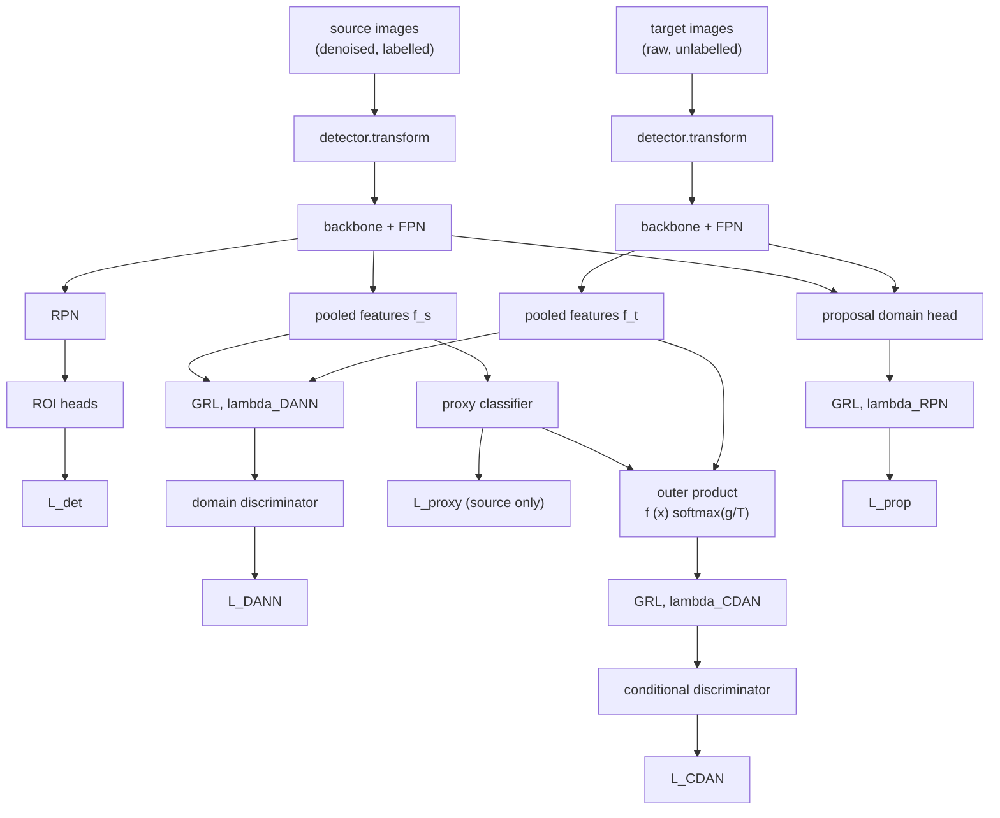

# DCCAN

DCCAN (Domain-Conditional Combined Adversarial Network) attaches three adversarial alignment paths
to a Faster R-CNN detector. It was proposed in my MSc dissertation; this document describes what
the code in `src/sonar/models/adaptation.py` actually does, which differs in two places from the
description in the dissertation. Those differences are noted inline.

## Setting

Unsupervised domain adaptation for detection. The source domain is median-filtered sonar with
labels; the target domain is raw sonar without labels. Both are 500x500 tiles with two foreground
classes, `object` (1) and `shadow` (2).

The detector is `fasterrcnn_resnet50_fpn` initialised from COCO weights with the box predictor
replaced for three classes.

## Forward pass

Each domain gets exactly one pass through `detector.transform` and one through the backbone, and
the resulting feature dict is shared by the RPN, the ROI heads and the domain heads. The original
implementation ran the backbone twice per step and fed the domain heads raw stacked tensors that
had skipped `transform`, so the discriminator saw unnormalised, unresized inputs. See finding 6 in
`AUDIT.md`.

## The three paths

**Global (DANN-style).** Adaptive-average-pool the FPN feature map to `[B, 256]`, concatenate
source and target, reverse the gradient, and classify the domain with an MLP
(256 to 1024 to 1024 to 1). Binary cross-entropy against source=1, target=0.

**Class-conditional (CDAN-style).** Form the outer product of the L2-normalised pooled feature and
the temperature-sharpened class posterior, flattened to `[B, 256 x 3]`, and classify the domain
from that. Conditioning on the class distribution is what lets the discriminator align `object`
features with `object` features rather than smearing the two classes together, which is the failure
mode of the purely global path.

Two conditioning sources are implemented:

- `conditioning="proxy"` — an image-level `nn.Linear(256, 3)` over the pooled features, trained by
  an auxiliary multi-label loss on which classes are present in the source targets. The softmax is
  still detached when it enters the outer product, so the domain loss cannot drag the classifier;
  the auxiliary loss is what keeps it meaningful. In the original this layer had no loss at all and
  never left its random initialisation (finding 4).
- `conditioning="roi"` — condition on the detector's own box-head class logits at ROI level, using
  RPN proposals for both domains, subsampled to 256 ROIs per image. Closer to CDAN as published,
  and the more principled of the two.

Stability for this path comes from temperature sharpening (T = 0.6) and a confidence gate: samples
whose maximum class probability falls below a threshold contribute zero, and the loss is normalised
by the number of samples kept. The threshold decays linearly from 0.40 to 0.20 across the first
half of training.

**Proposal-level.** A two-layer convolutional head (3x3 conv, ReLU, 1x1 conv) applied directly to
the FPN feature map, mean-pooled to one logit per image. This aligns spatial statistics before the
RPN consumes them.

The feature map used is FPN level `"0"`, which for a ResNet-50 FPN is **P2** (stride 4). The
dissertation describes it as P3. The level is a configuration value (`feature_level`) so the
distinction is at least now explicit.

## Objective

Each path is attached through a gradient reversal layer whose coefficient follows a logistic ramp

$$\lambda_k(p) = \lambda_k^{\max}\left(\frac{2}{1 + e^{-10p}} - 1\right), \qquad p = \frac{\text{step}}{\text{total steps}}$$

with $\lambda^{\max}_{\text{DANN}} = 0.20$, $\lambda^{\max}_{\text{CDAN}} = 0.30$,
$\lambda^{\max}_{\text{prop}} = 0.10$.

The dissertation writes the objective as

$$L = L_{det} + \lambda_{DANN}(t) L_{DANN} + \lambda_{CDAN}(t) L_{CDAN} + \lambda_{RPN}(t) L_{RPN}$$

That is not what the code computes, and the difference matters. The losses are summed **unweighted**
and $\lambda$ enters only as the gradient reversal coefficient. So the discriminators are trained at
full strength regardless of $\lambda$, and $\lambda$ scales only the adversarial gradient flowing
back into the feature extractor:

$$\theta_d \leftarrow \theta_d - \eta \frac{\partial \sum_k L_k}{\partial \theta_d}, \qquad
\theta_f \leftarrow \theta_f - \eta\left(\frac{\partial L_{det}}{\partial \theta_f} - \sum_k \lambda_k(p)\frac{\partial L_k}{\partial \theta_f}\right)$$

This is the standard DANN formulation and it is the sensible choice — a discriminator held back by
a small $\lambda$ early in training would be too weak to provide a useful signal. The printed
equation was simply wrong.

## Optimisation

Two parameter groups: the detector plus the proxy classifier at lr 1.5e-3, and the three domain
heads at 4.5e-4, both SGD with momentum 0.9 and weight decay 5e-4. The discriminators are
deliberately slower so they do not dominate the backbone early.

The backbone is frozen for the first two epochs so the replaced box predictor can settle before
adversarial pressure arrives, then unfrozen. `freeze_backbone` is reversible; the original set
`requires_grad = False` and never restored it, and separately tried to freeze batch-norm layers
with an `isinstance` check against `nn.BatchNorm2d` that never matched, because torchvision's
pretrained ResNet-50 FPN uses `FrozenBatchNorm2d`.

Gradients are clipped at norm 5.0 after `scaler.unscale_` under mixed precision.

## Why the hybrid

The motivation still stands even though the evidence for it does not. A purely global discriminator
has no way to distinguish an `object` feature from a `shadow` feature, so aligning the marginal
feature distributions can align them across classes — exactly the confusion that matters in sonar,
where a shadow is an elongated dark region and an object is an elongated bright one. Conditioning
on class posteriors addresses that, at the cost of an outer-product mapping whose variance made a
standalone CDAN unstable under AMP in my runs. Combining a low-weight conditional path with a
stronger global path, plus a cheap spatial path before the RPN, was the compromise.

What I can defend is that this trains stably under mixed precision. Whether it detects better than
a plain baseline is, after the audit, an open question.
